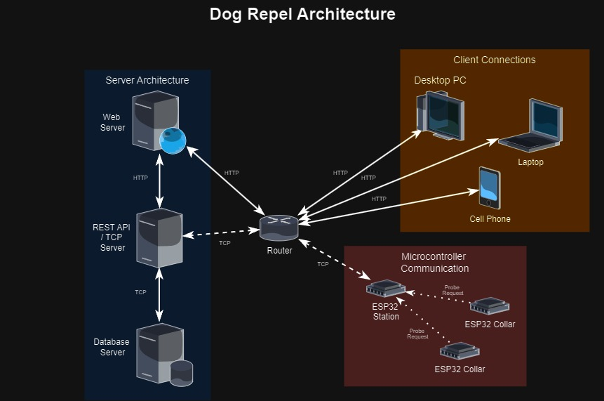

# Dog Behavior Tracking System with ESP32



This project tracks dog behavior using ESP32 devices to measure proximity between dogs (wearing collars with ESP32s) and Wi-Fi stations. Data is logged into a server for visualization on a web interface.

## Features

- Tracks proximity between dogs and Wi-Fi stations
- Logs visit frequency and distance to a MySQL database
- Visualizes data with charts and pictures on a web interface
- Real-time behavior monitoring

## Installation

### ESP32 Devices

1. Install the ESP-IDF toolchain following the [ESP-IDF installation guide](https://docs.espressif.com/projects/esp-idf/en/latest/esp32/get-started/index.html).
2. Configure your Wi-Fi credentials in the code (`WIFI_STA_SSID` and `WIFI_STA_PASSWD`).
3. Build and flash the ESP32 devices:
   ```bash
   idf.py build
   idf.py flash
   ```

#Backend Server
Clone the repository:
```bash
git clone https://github.com/your-repo/dog-behavior-tracking-system.git
cd dog-behavior-tracking-system
```

Install dependencies:
```
npm install
```
Set up the MySQL database and import the schema.

Start the backend server:
```
npm run start
```
#Frontend Web Interface
1. Navigate to the frontend folder:
   ```
   cd Website
   ```
2. Install frontend dependencies:
   ```
   npm install
   ```
3. Start the web application:
   ```
   npm run dev
   ```

# Usage
1. Register the dog collars and stations with the server.
2. Monitor proximity events and log data in real-time.
3. Configure station settings and view the dog’s behavior on the web interface.
